# Git
## ¿Qué es Git?

Git es un software de control de versiones diseñado por Linus Torvalds, pensando en la eficiencia y la confiabilidad del mantenimiento de versiones de aplicaciones cuando éstas tienen un gran número de archivos de código fuente.

A continuación comentaremos con instalar y comenzar a usar Git en Windows y Linux:

## Instalación en Windows

Comenzamos con la instalación en Windows. A continuación se mostrarán unas capturas paso a paso sobre como instalar Git en Windows.

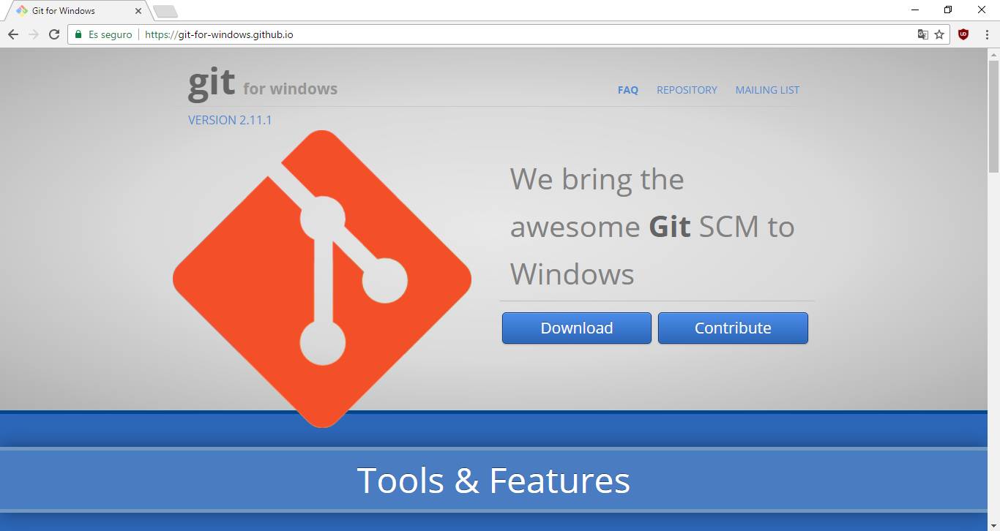
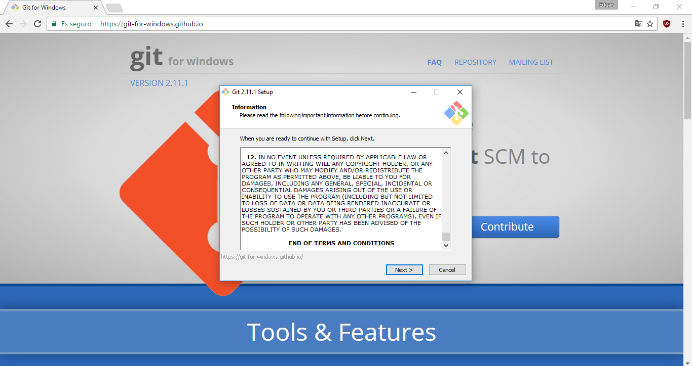
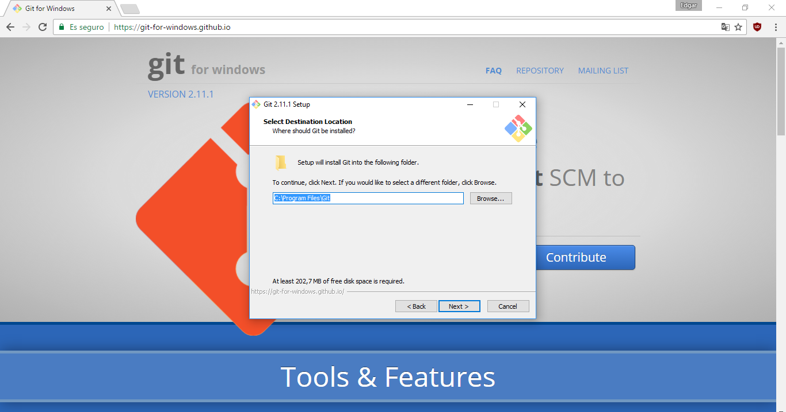
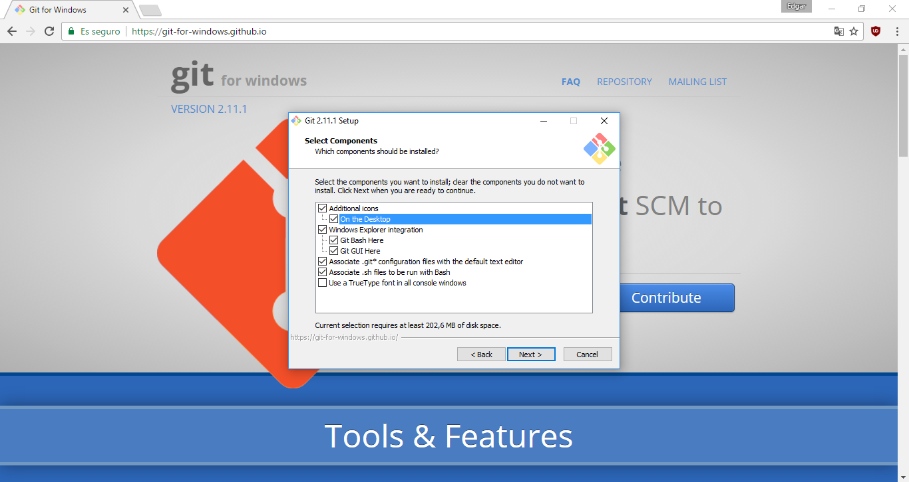
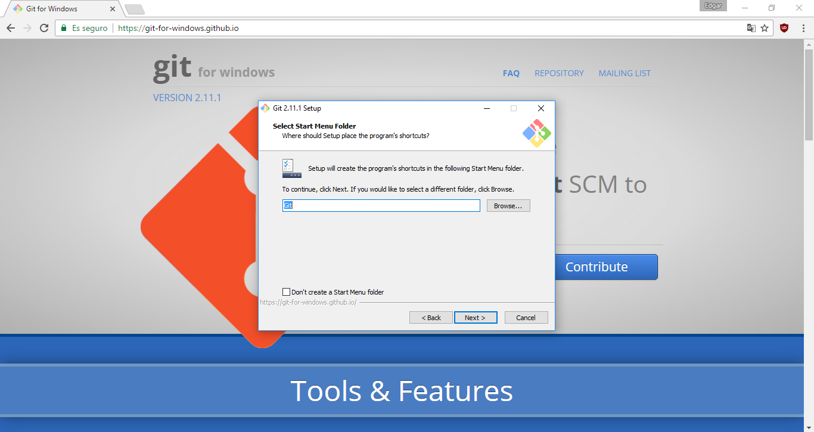
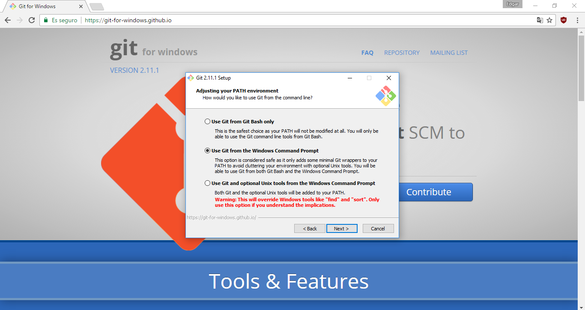
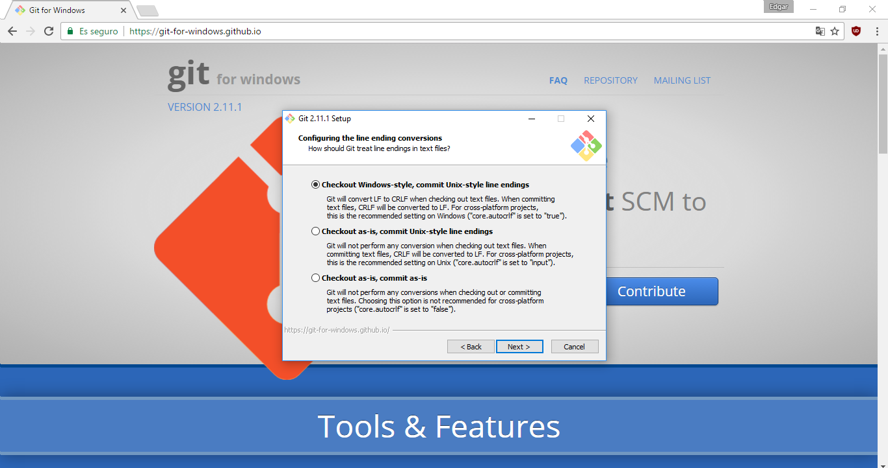
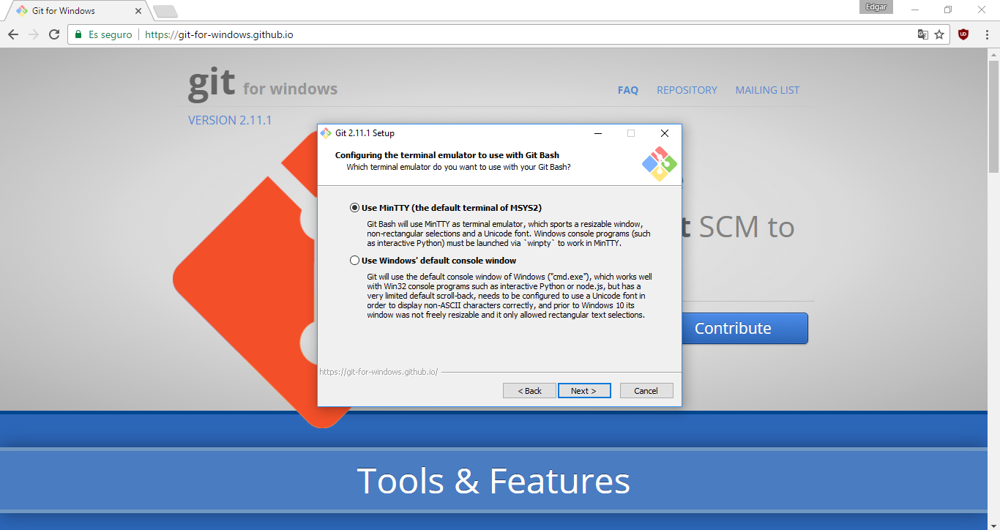
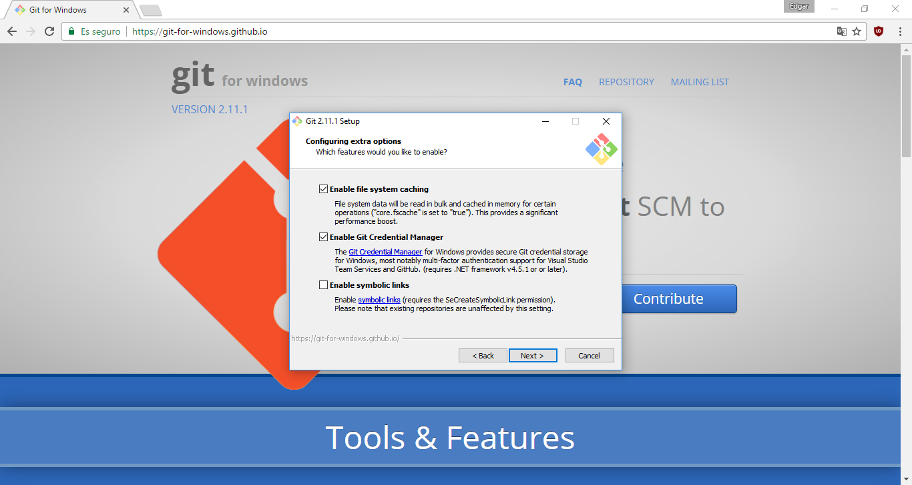
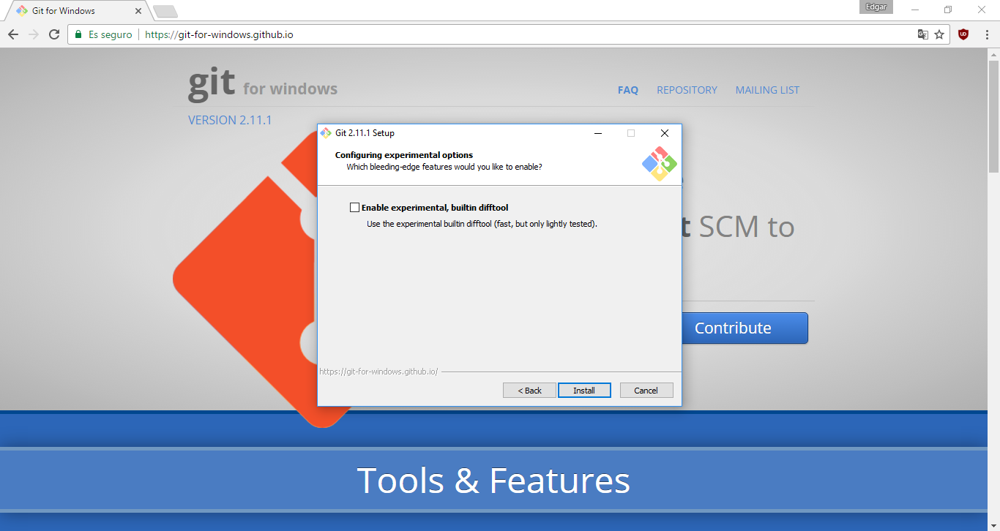
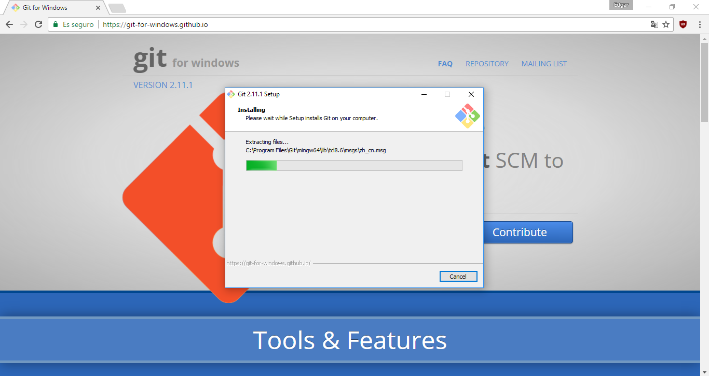

## Instalación en Linux

Para instalar Git usaremos el comando:

```bash
$ apt-get install git
```

Con esto estamos listos para empezar a usar git en nuestro ordenador

## Como usar Git

Son muchas las opciones que nos ofrece Git como servicio pero para usarlas primero tenemos que activarlo en el lugar en el que estemos trabajando.
Para ello usaremos el comando sobre el directorio sobre el que queramos trabajar:

```bash
$ git init
```
Tras ejecutar este comando nuestro directorio pasará a ser/llamarse __repositorio__ y comenzará a estar bajo el control de versiones.
Para observar el estado del repositorio usaremos:
```bash
$ git status
```
Cada cambio generado en los ficheros de nuestro repositorio se añadirán al control de versiones con el comando:

```bash
$ git add .
```
Lo siguiente sería hacer una confirmación (famosamente conocida como __commit__) que generará una impresión de la versión actual de nuestro proyecto.
```bash
$ git commit -am "Mensaje"
```
### Commits

La unión de varias confirmaciones genera lo que es conocido como el __árbol de confirmaciones__. Este posee __ramas__ que son líneas de confirmaciones con distintas versiones del proyecto que se encuentra bajo el control de versiones.
La rama que viene por defecto en los repositorios git es la __master__ y en caso de no hacer ningún tipo de acción adicional (Posteriormente lo veremos) todas las confirmaciones se añadirán a esta.

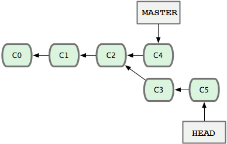

Estas ramas son seleccionable, permitiendonos trabajar con las diferentes versiones de nuestro proyecto _(En la master tenemos el código que funciona seguro mientras que en la rama "pruebas" hacemos avances y añadimos a la master los que funcionen)_.
Para visualizar las ramas de nuestro proyecto:
```bash
$ git branch
```
Este comando muestra las ramas del repositorio local (El situado en nuestro ordenador). Para ver las ramas alojadas en los repositorios remotos (Por ejemplo en GitHub) le añadimos la opción "-a".
Para crear una nueva rama usaremos el comando:
```bash
$ git checkout -b <NOMBRE DE LA RAMA>
```
Y para eliminarla:
```bash
$ git checkout -d <NOMBRE DE LA RAMA>
```
Y por último para situarnos en una rama:
```bash
$ git checkout <NOMBRE DE LA RAMA>
```
### Mezclar Ramas
Tras ver todo esto nos preguntamos ¿Cómo llevamos los cambios hechos en una rama a la rama principal "master"?
La respuesta es __mezclando/fusionando__ ámbas ramas en la master:
```bash
$ git merge <NOMBRE DE LA RAMA>
```
Esto "impactará" los cambios de la rama seleccionada sobre la rama en la que te encuentras, uniendo ambas.
Así, en caso de querer unir los cambios de la rama "pruebas" con la rama "master" haríamos lo siguiente.
```bash
$ git checkout master
$ git merge pruebas
```
### Trabajando con repositorios remotos

Todos nuestros proyectos almacenados en repositorios pueden subirse a repositorios remotos al igual que se pueden descargar/clonar de estos.
Para ver la lista de repositorios remotos vinculados a tu repositorio local ejecuta:
```bash
$ git remote -v
```
Para añadir/vincular un repositorio remoto con tu local usa:
```bash
$ git remote add <ALIAS DEL REPOSITORIO> <URL DEL REPOSITORIO>
```
Para clonar un repositorio remoto, no es necesario una vinculación con este. Simplemente nos situamos en la carpeta local donde quieres que se clone el remoto y ejecutamos:
```bash
$ git clone <URL DEL REPOSITORIO>
```
El repositorio clonado ya estará bajo el control de versiones mientras que los que vincules primero has de ponerlos bajo este con "git init".
Una vez completada la vinculación, las opciones principales que git nos ofrece son las siguientes:

Comando                   | Acción
--------------------------|-----------------------------------------------
__$ git push ALIAS RAMA__ | Guarda y sobrescribe los cambios de tu repositorio dentro del remoto con alias ALIAS dentro de la rama RAMA.
__$ git pull ALIAS RAMA__ | Sobrescribe los cambios del repositorio remoto con alias ALIAS dentro de tu repositorio local dentro de la rama RAMA.
__$ git fetch__           | Descarga de los cambios realizados en el repositorio remoto.

__IMPORTANTE: Recordar que para trabajar con repositorios remotos, primero has de guardar los cambios con "git add ." y "git commit".__
