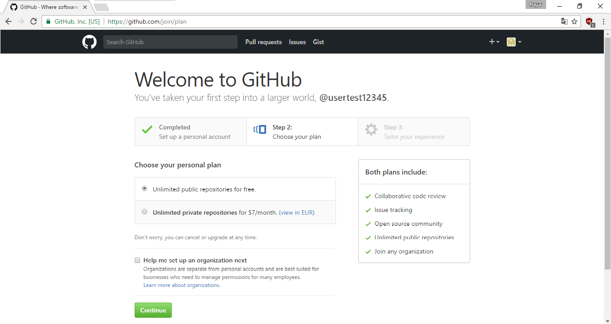
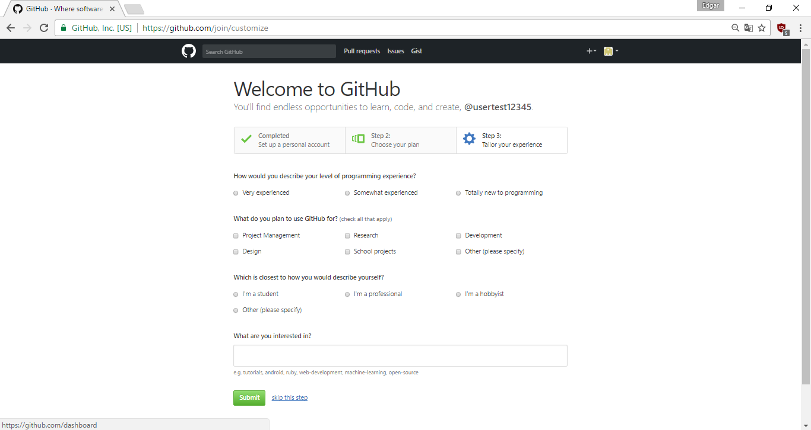
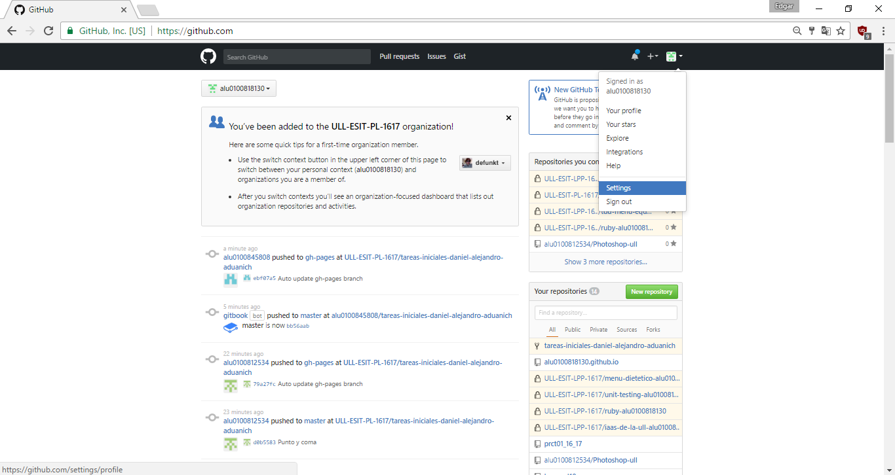
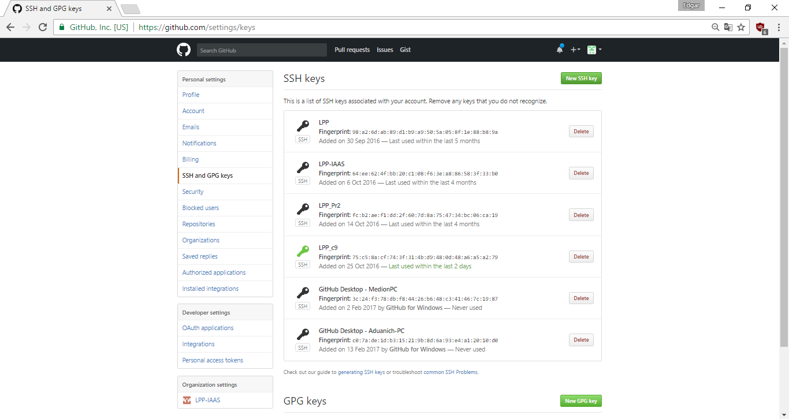
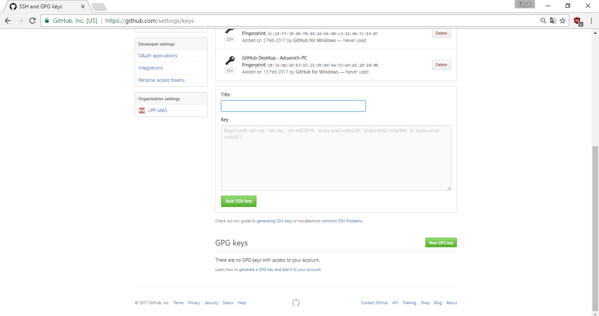

# Github
## ¿Qué es Github?

GitHub es una forja (plataforma de desarrollo colaborativo) para alojar proyectos utilizando el sistema de control de versiones Git.
Para crearte una cuenta en GitHub accede a su página web: [www.github.com](www.github.com)

Haces click en la opción de Sign Up (o registrarse) y completas el formulario que te piden a continuación.


Con la cuenta ya creada, pasamos a vincularla con nuestro repositorio local.

#### Vinculación de GitHub con Repositorio Local

Para vincular tu equipo de trabajo y tus repositorios co GitHub necesitas una pareja clave pública - clave privada.
Por ello debe generar una nueva pareja de clave-pública clave-privada en el directorio .ssh:
```bash
$ ssh-keygen -t rsa
```
Para usar las opciones por defecto, a cada pregunta responda pulsando la tecla de retorno de carro.
Muestre por la consola la clave-pública que ha generado:
```bash
$ cat ~/.ssh/id_rsa.pub
```
Copie la clave y vuelva a GitHub. Entre en sus opciones de perfil (Como aparece abajo en la imagen).

Acceda a la sección de Claves SSH:

Y cree una Clave nueva con el nombre de su máquina y pegue la Llava pública generada anteriormente:

Guarde la llave y los cambios y ya está preparado para subir sus repositorios a GitHub.
